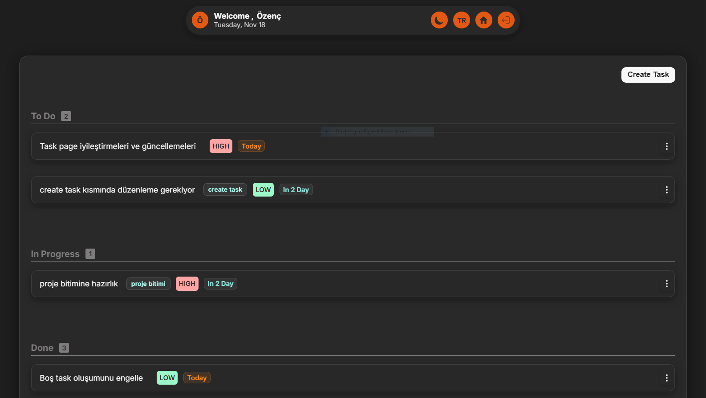
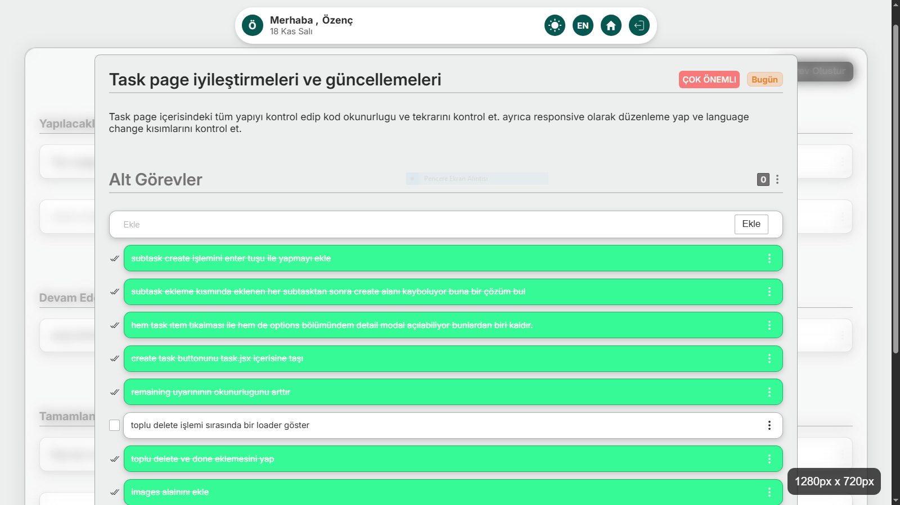
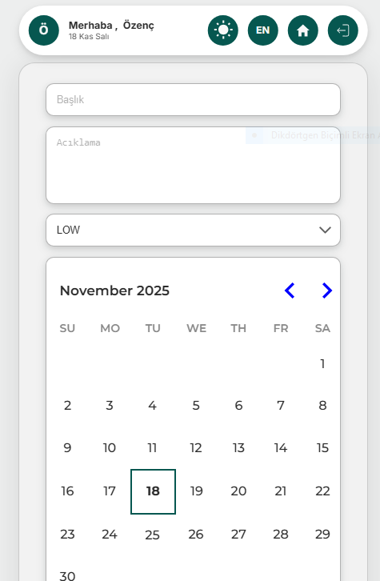
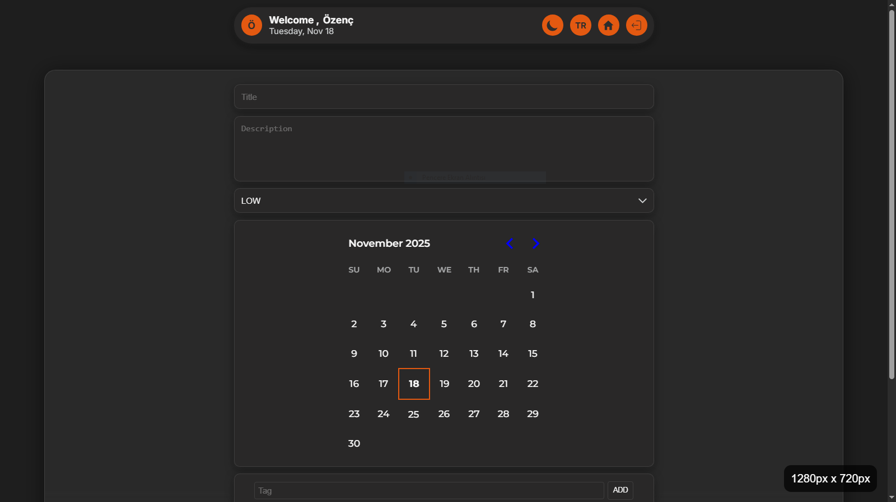
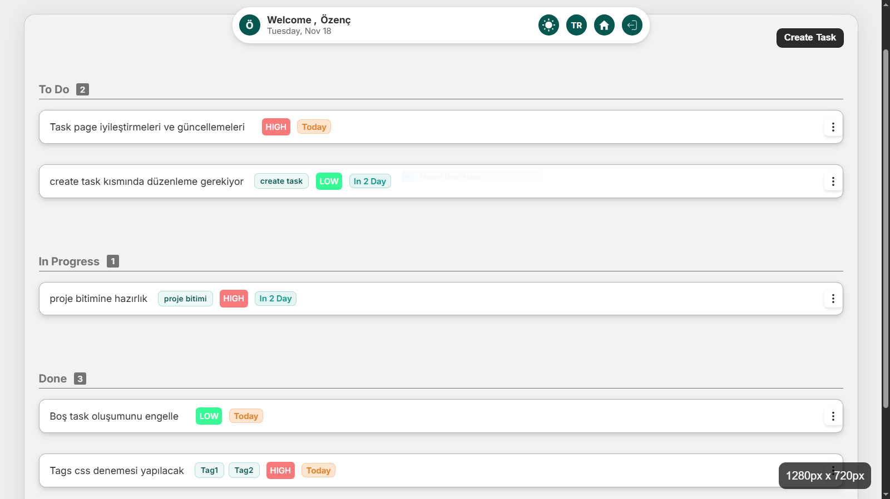
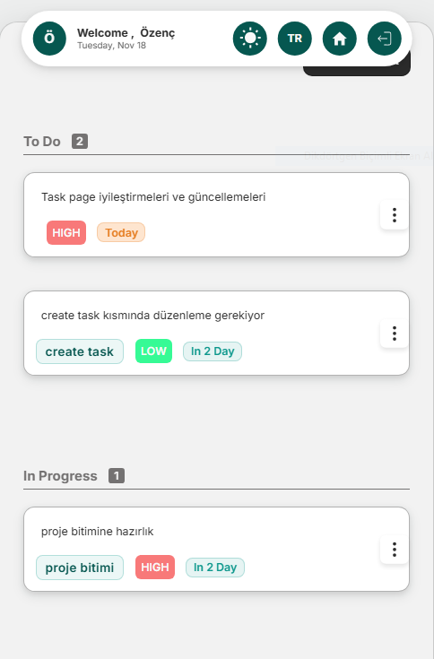

# TaskFlow

**A modern and responsive task management application**  
Build with **React (Vite) frontend**, **Node.js + Express backend**, **PostgreSQL + Prisma** database, and **Cloudinary** for image storage.

---

## 🌟 Features

- **User Authentication** (Sign up, Sign in, JWT-based)
- **CRUD Operations** for Tasks and Subtasks
- **Multi-language Support**: English & Turkish
- **Dark & Light Theme**
- **Drag & Drop** task management system
- **Image Attachments** for tasks
- **Responsive Design** for mobile and desktop

---

## 💻 Tech Stack

**Frontend:**

- React (Vite)
- Tailwind / CSS Modules (styling, optional)
- Responsive design & modern UI

**Backend:**

- Node.js + Express
- JWT Authentication
- REST API

**Database & Storage:**

- PostgreSQL + Prisma ORM
- Cloudinary (task image storage)

---

## 📜 Database Schema

```prisma
datasource db {
  provider = "postgresql"
  url = env("DATABASE_URL")
}

generator client {
  provider = "prisma-client-js"
}

model User {
  id String @id @default(uuid())
  email String @unique
  password String
  name String?
  avatar String?
  themePrefence String?
  lastLoginAt DateTime?
  createdAt DateTime @default(now())

  tasks Task[]
}

model Task {
  id String @id @default(uuid())
  title String
  description String?
  status Status @default(TODO)
  priority Priority @default(MEDIUM)
  dueDate DateTime?
  tags String[]
  createdAt DateTime @default(now())
  updatedAt DateTime @updatedAt

  user User @relation(fields: [userId], references: [id])
  userId String

  images TaskImage[]
  subtasks Subtask[]
}

enum Status {
  TODO
  IN_PROGRESS
  DONE
}

enum Priority {
  LOW
  MEDIUM
  HIGH
}

model TaskImage {
  id String @id @default(cuid())
  url String
  publicId String @unique
  createdAt DateTime @default(now())

  task Task @relation(fields: [taskId], references: [id])
  taskId String
}

model Subtask {
  id String @id @default(uuid())
  title String
  isDone Boolean @default(false)
  createdAt DateTime @default(now())
  updatedAt DateTime @updatedAt

  task Task @relation(fields: [taskId], references: [id], onDelete: Cascade)
  taskId String
}
```

---

## 🚀 Getting Started

### Backend

```bash
cd backend
npm install
npm run dev
```

### Frontend

```bash
cd frontend
npm install
npm run dev
```

---

## 💾 Project Structure

```
root/
│
├─ backend/        # Node.js + Express backend
└─ frontend/       # React + Vite frontend
```

---

## 💌 Contact

- Email: [ozzencben@gmail.com](mailto:ozzencben@gmail.com)
- LinkedIn: [Özenç Dönmezer](https://www.linkedin.com/in/%C3%B6zen%C3%A7-d%C3%B6nmezer-769125357/?locale=tr_TR)

---

## 🌈 Screenshots

### Desktop View



### Task Detail



### Mobile View







---

## ⚡ Notes

- Fully responsive and mobile-friendly design.
- Drag & drop task reordering with smooth animations.
- Supports image attachments per task with Cloudinary storage.
